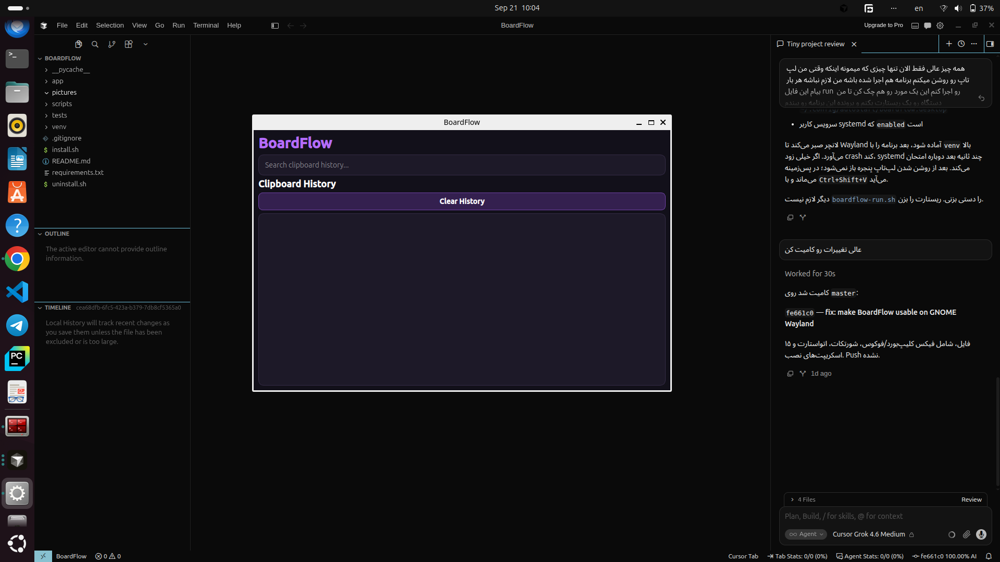
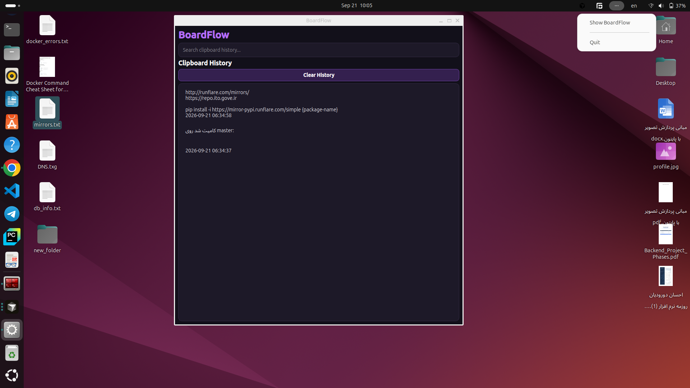

# BoardFlow

مدیر سادهٔ تاریخچهٔ کلیپ‌بورد برای دسکتاپ لینوکس (GNOME / Wayland).

پروژهٔ آموزشی و کاربردی است: متن‌هایی که کپی می‌کنید ذخیره می‌شوند تا بعداً جستجو و با یک کلیک برگردانده شوند. محصول تجاری نیست.

## امکانات

- ذخیرهٔ خودکار متن کلیپ‌بورد در SQLite
- جستجو در تاریخچه
- بازگرداندن آیتم با کلیک
- پاک‌کردن کل تاریخچه
- اجرا در پس‌زمینه
- کلید میانبر: `Ctrl+Shift+V`
- اجرای خودکار پس از ورود به سیستم

## فناوری

Python 3.12، PySide6، SQLite، `wl-clipboard` (`wl-copy` / `wl-paste`).

## ساختار

```
BoardFlow/
├── app/
│   ├── main.py
│   ├── autostart.py
│   ├── shortcut.py
│   ├── clipboard/
│   ├── database/
│   └── ui/
├── scripts/
│   ├── boardflow-run.sh
│   └── boardflow-shortcut.py
├── screenshots/
├── install.sh
├── uninstall.sh
└── requirements.txt
```

## پیش‌نیاز

- لینوکس Wayland (تست‌شده روی Ubuntu + GNOME)
- Python 3.12+
- بستهٔ سیستمی `wl-clipboard`

```bash
sudo apt install wl-clipboard
```

## نصب و اجرا

```bash
git clone <https://github.com/EhsanDoroudian/BoardFlow>
cd BoardFlow
python3 -m venv venv
source venv/bin/activate
pip install -r requirements.txt
./scripts/boardflow-run.sh
```

حتماً از پایتون `venv` استفاده کنید؛ `python3` سیستم معمولاً PySide6 ندارد.

اتواستارت و میانبر گنوم:

```bash
./install.sh
```

حذف اتواستارت و میانبر:

```bash
./uninstall.sh
```

تاریخچه در `~/.local/share/boardflow/` می‌ماند.

## استفاده

متن را کپی کنید تا در فهرست بیاید. روی آیتم کلیک کنید تا دوباره در کلیپ‌بورد قرار گیرد. با «Clear History» همه پاک می‌شود.

بستن پنجره برنامه را نمی‌بندد؛ به سینی می‌رود. دابل‌کلیک روی آیکون یا منوی سینی پنجره را نشان می‌دهد.

`Ctrl+Shift+V` پنجره را از هر جای دسکتاپ باز می‌کند.

پس از `./install.sh` برنامه با ورود به سیستم در پس‌زمینه اجرا می‌شود.

## محدودیت‌ها

- فقط متن؛ تصویر و فایل پشتیبانی نمی‌شود.
- `wl-paste --watch` در GNOME در دسترس نیست؛ خواندن کلیپ‌بورد بعد از مکث کوتاه کاربر انجام می‌شود تا فوکوس کیبورد دزدیده نشود.
- میانبر با `gsettings` روی GNOME ثبت می‌شود.
- روی X11 / KDE / Sway تست نشده است.

## تصاویر





## بهبودهای ممکن

پشتیبانی از تصویر، محدود کردن آیتم‌های حساس، و سازگاری با محیط‌های غیر GNOME.
